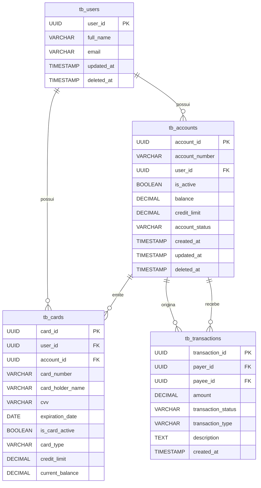

# 💳 NizoPay System

**NizoPay** é um sistema de gestão de contas digitais que simula uma carteira virtual. Com ele, é possível criar usuários, contas bancárias, cartões e realizar transações financeiras. Ideal para fins educacionais, prototipagem de fintechs ou estudos de arquitetura de software com regras de negócio bem definidas.

### 🔗 Documentação da API

Acesse a documentação completa:\
👉 [Swagger UI](https://nizopay-system.onrender.com/swagger-ui/index.html#/)

---

## 📌 Funcionalidades

- Cadastro e gerenciamento de usuários;
- Criação automática de contas com número e agência;
- Solicitação, aprovação ou rejeição de crédito;
- Emissão de cartões com geração automática de número válido;
- Operações financeiras: depósitos, saques e transferências;
- Controle de status, saldo e limite de crédito;
- Validação de cartões por data de expiração e status de ativação.

---

## 📊 DER - Diagrama Entidade Relacionamento



---

## ⚙️ Regras de Negócio

### Contas:

- Podem solicitar crédito (status `PENDING`);
- Podem ser aprovadas (`APPROVED`) ou rejeitadas (`REJECTED`);
- Podem ter múltiplos cartões vinculados;
- Realizam depósitos, saques e transferências com validações de saldo.

### Cartões:

- Podem ser ativados/desativados;
- Devem estar válidos (ativos e com data de expiração futura);
- Possuem saldo e limite de crédito independente da conta.

### Transações:

- Apenas permitidas se houver saldo suficiente (ou crédito disponível);
- Registradas com status (`PENDING`, `COMPLETED`, etc.) e tipo (`DEPOSIT`, `TRANSFER`, etc.).

---

## 🛠️ Tecnologias Utilizadas

- **Java 17+**
- **Spring Boot**
- **Lombok**
- **Swagger UI** (documentação interativa)
- **Banco de Dados:** PostgreSQL
- **Identificação via UUID**

---

## 🚀 Como Executar o Projeto

1. **Clone o repositório:**

```bash
git clone https://github.com/seu-usuario/nizopay-system.git
cd nizopay-system
```

2. **Configure o banco de dados**\
   Ajuste o `application.properties` com as credenciais do seu banco (ou utilize H2 em memória).

3. **Execute a aplicação:**

```bash
./mvnw spring-boot:run
```

4. **Acesse a API localmente:**

```
http://localhost:8080/swagger-ui/index.html
```
